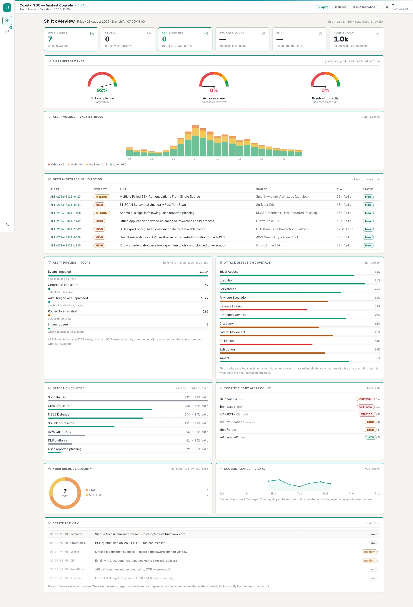

# SOC Analyst Simulator

A working replica of a Tier-1 analyst console, built to practise the whole shift rather than a quiz about it: a shift dashboard shows you what the estate is doing, alerts arrive in a queue with SLA clocks running, you investigate by typing your own searches against simulated data sources, enrich indicators you pull out of the evidence yourself, take real response actions that can help or make things worse, and write the incident report — at a fictional bank, Coastal Trust Bank, with a CISO, a CEO, an IR lead and an employment lawyer who react to what you actually did.

Thirteen alert scenarios dealt seven to a shift, 24 searchable data sources, 65 searches over 240 events, 94 response actions of which 38 are mistakes.

**[Live demo →](https://nicky-quist.github.io/soc-analyst-simulator/)**



## Why this exists

Most SOC practice tools (this repo's own [soc-triage-tool](https://github.com/nicky-quist/soc-triage-tool), LetsDefend, TryHackMe SOC rooms) stop at "classify this alert correctly," and they hand you the evidence: click the pivot, read the result, pick from the dropdown. Real L1 work has three parts that multiple-choice can't reach — you have to *find* the evidence, decide *what to do about it*, and live with the consequences of both. The most common way a new analyst fails isn't picking the wrong classification. It's searching the wrong index, leaving the time picker on its default, treating "no records found" as "clean," or reaching for a containment action that breaks something.

So this sim is built so those things can happen to you.

## The console

**Shift dashboard** — the landing view, because a real console opens on posture rather than on a ticket. Six KPI tiles (open, closed, SLA breaches, average case score, MTTR, alerts today), 24-hour alert volume stacked by severity, your queue's severity mix, an actionable open-alerts table you can click straight into, the day's detection sources with their auto-close rates, a 7-day SLA compliance trend against target whose last point is yours, top entities by alert count, ATT&CK detection coverage by tactic, and a live tail of estate activity. All of it is inline SVG — no charting dependency, no network calls.

**Your numbers, not the estate's.** SLA compliance on the dashboard is computed from the cases *you* closed and the clocks *you* let run out — an alert counts once you close it or once it breaches, so the gauge starts at 100%, moves the moment you finish a case, and drops when one goes over. Today's point on the 7-day trend is left visibly empty until then, rather than filled with a number the console invented. The six days behind it are generated per shift: most weeks lose one day below target, a bad week loses two running, one in five comes in clean, and the caption under the chart describes the week that was actually drawn.

The panel that matters most is the **alert pipeline**: 41.2M events → 1,284 alerts → 1,179 closed by automation → 105 routed to analysts → 7 in your queue. That funnel is the part of the job a quiz never shows you, and it is why "just look at every alert" is not a strategy.

**Alert queue** — seven alerts with status (New / In progress / Closed), the tool's reported severity, and a live SLA countdown that goes red when breached. Shift KPIs sit in the header too, so the numbers follow you out of the dashboard.

**A dealt hand, not a fixed list.** The library holds thirteen scenarios and a shift deals seven of them, seeded from when the shift started, so a second sitting is a different queue in a different order. The deal is not a straight random draw: every hand is guaranteed at least one alert that should be closed rather than escalated, at least one that has to reach IR tonight, at least two that belong with Tier 2, and a spread of difficulty — because a queue of seven true positives quietly teaches an analyst to escalate everything. Reset deals the next hand.

**Overview** — detection metadata (rule, rule ID, data source, entities) and the triggering event, exactly as much as a SIEM would give you. The reported severity is labelled "what the tool said — yours to confirm or overturn."

**Investigate** — a search bar, not a list of buttons. You type `index=auth 185.220.101.45` and get an event table back. The indicators have to come out of the evidence; the console never offers them. Results print with a note explaining what you're looking at, and the search history reads as an investigation log. There's also a decoder for base64 blobs — which is the only way to get the C2 address out of the PowerShell scenario.

**Intel** — paste an indicator, get a feed record: verdict, confidence, first-seen, sources, tags. Defanged input (`1[.]2[.]3[.]4`) is understood, because that's how indicators arrive in tickets.

**Respond** — the containment actions an L1 can really take, with no hint as to which are correct, ordered by a stable shuffle so the bad ones aren't always at the bottom. Two-click confirm, no undo, and every one is recorded in the case.

**Report** — classification, severity, an ATT&CK technique picked from a catalog of plausible candidates, a written summary and remediation, and the escalation decision.

**Case notes** — a running timeline of every search, lookup, action, and decode with elapsed times. It's the audit trail a Tier-2 handoff would be built from, and reading your own back is usually how you notice you spent eleven minutes searching before you contained anything.

Dark by default, with a light toggle.

## Ways to get it wrong

This is the part the sim is actually about. All of these are live:

| What you do | What happens |
|---|---|
| Mistype an octet in a search | `0 events` — "check the indicator character by character." No "did you mean," because a real console doesn't offer one. |
| Leave the time picker at its 15-minute default | `0 events` on a correct search. The hint tells you the search was right and the window wasn't — after you've had a moment to believe nothing happened. |
| Search the right value in the wrong index | "That value exists in this environment — you are searching the wrong data source." |
| Invent an index that doesn't exist | An error listing the ones that do. |
| Mistype an indicator into threat intel | "No records found" — which looks exactly like a clean verdict, and is flagged as such. |
| Run external threat intel on an internal 10.x address | "Private address space — no external intel." A clean result there means nothing; inventory is the right tool. |
| Reboot a compromised host to "kick them out" | The IR lead explains what was in that memory. |
| Isolate the source of a scan that turned out to be your own vulnerability scanner | Security Engineering's manager, on the compliance scan you just killed. |
| Reply to the fraudulent vendor email to confirm the account | You just emailed the attacker, from inside the mailbox they're sitting in. |
| Reimage a ransomware-precursor host before triage | IR can no longer tell whether credentials were stolen, so the incident is now unscoped. |
| Contact the employee in the insider case, or disable their account on your own authority | Employment counsel, on why that isn't Security's call to make alone. |
| Delete the scheduled task and close the ticket | One artifact gone, C2 still live, and the operator now knows they were seen. |
| Rewrite the git history to remove a leaked cloud key and call it fixed | The key is still valid, still in every clone, still being used. Only deactivating it is containment. |
| Delete the IAM user instead of the key | Production ETL breaks and the audit trail stops resolving, for no extra containment. |
| Restore a quarantined credential dumper because the admin says it is approved | The request they cite is still unapproved — you can see that in the ticket. |
| Close a blocked detection because "the EDR handled it" | The block is not the finding. Two other hosts ran the same tool unblocked. |
| Isolate a laptop over a file that never executed | Disruption without benefit, on the one host where nothing happened. |

Harmful actions fail the case outright, whatever the report says. A correct classification followed by a damaging response is not a resolved alert.

## Learn Mode

Every scenario has a **📖 Learn mode** walkthrough of how a senior analyst works that specific alert — which search to run and why, how to read the result, why the response order is isolate → preserve → remediate. Use it either way: study it first, or attempt the alert cold and check your reasoning afterward. Opening it before you submit tags that attempt **Assisted** in the shift record — not a penalty, just an honest label.

## Scenarios (13)

- **SSH brute force that succeeded** — true positive, critical. Tests whether you notice the single `Accepted password` line buried after the failures, widen the time range to find the post-login activity, and connect `/etc/shadow` plus a `tar` of the MySQL directory to credential theft and data staging. The asset record also shows configuration drift: root SSH login enabled on a host that was never meant to accept SSH from the internet.
- **Vulnerability scanner flagged as reconnaissance** — false positive. Tests whether you identify an internal source through asset inventory and the change calendar before acting, and whether you resist quarantining your own department's scanner mid-window.
- **Phishing → token replay → attempted wire fraud** — true positive, critical, 10-minute target. Four separate-looking signals that are one Business Email Compromise. MFA didn't prompt because the phishing page took the session cookie, which is why revoking sessions has to come before resetting the password. There's still time to stop the payment if you find it.
- **Malicious macro → PowerShell downloader → ransomware precursor** — true positive, critical. The C2 address only exists inside a base64 `-EncodedCommand`, so the investigation doesn't proceed until you decode it. Then: persistence, share enumeration, live beaconing, and three other mailboxes that got the same attachment, two still unopened.
- **Ambiguous insider case — large after-hours export by a departing employee** — deliberately not a clean true/false positive. The anomaly is scale, timing, destination, and a missing approval — not access. One of the required searches legitimately returns zero rows, and that emptiness is the finding.
- **Leaked AWS key → S3 enumeration and download** — true positive, critical, and the first one with no host to isolate and no malware to find. A service-account key sat in a public repo for six days; the whole investigation runs through CloudTrail, IAM, and the secret-scanning log. Two traps: rewriting the git history feels like remediation and invalidates nothing, and "the bucket was accessible" is a very different sentence from "12,900 customer records were downloaded."
- **Credential-dumping tool quarantined on an admin's laptop** — the escalation-calibration case: the right answer is **Tier 2**, and both neighbours are wrong. The block worked here, so it is not an IR page; the same hash executed unblocked two days ago on two hosts with a 14-month-old sensor, so it is not a closure either. The tool is dual-use, there is a pending approval request nobody actioned, and the user is a domain admin. One available action is restoring the file because the admin asks you to.
- **MFA push fatigue ending in an approval** — true positive, critical, 20-minute target. The password succeeded every time and only the second factor was challenged, so the credential is already stolen; fourteen denials from one address then a single approval is a user worn down, not a user signing in. The detection rated it MEDIUM, and everything that makes it critical (a newly registered authenticator, a changed recovery address, an inbox rule, Treasury downloads) sits in logs the detection never read.
- **Impossible travel that is really the VPN** — false positive. The "foreign" address is the bank's own EU VPN egress, never added to named locations, and the change calendar shows an emergency failover that morning. The skill is disproving a plausible story quickly and defensibly, and three of the available actions (blocking the egress, disabling the user, revoking sessions for everyone behind that address) would take down working staff.
- **Web shell on an internet-facing IIS server** — true positive, critical, 15-minute target. An IIS worker process spawning `cmd.exe` is enough on its own; the EDR trail shows enumeration, a look at a loan-document share, and a second stage pulled with `certutil`. The trap is cleanup: deleting the shell or rebooting feels like remediation and destroys the evidence while the second stage keeps running.
- **Crypto miner on a CI build agent** — true positive, high, **Tier 2**. The IDS signature reads as a nuisance policy alert, but no human is in the execution chain: an npm postinstall script from a two-day-old package fetched the miner and added a SYSTEM scheduled task on a machine holding a deployment token and a signing key. The miner is the visible part; the supply-chain exposure is the case.
- **OAuth consent phishing** — true positive, high, **Tier 2**. No malware, no failed sign-ins, no impossible travel: the user approved a real Microsoft consent screen for an unverified app, and a second user did the same nine minutes later. The access lives in a grant and a refresh token, so resetting passwords does nothing, and the audit trail (mail access, searches for "wire" and "invoice") is what shows it's real.
- **Possible DNS tunnel from signed marketing software** — the case that should *not* be resolved. Fourteen thousand TXT queries with near-unique 48-character labels to a domain first seen three days ago is data being encoded, but the binary is signed and the domain has no reporting. The right classification is "suspicious, needs more investigation", with a precise statement of what is known and what would settle it; closing it either way is the mistake.

## Grading

A case is scored on four things, because a shift is judged on four things:

| Component | Weight |
|---|---|
| Classification | 20 |
| Escalation decision | 20 |
| Severity (half credit one step off) | 10 |
| MITRE ATT&CK technique (parent technique counts) | 10 |
| Written report rubric | 25 |
| Response actions taken | 15 |

**"✓ Resolved correctly"** requires the right classification and escalation — and the correct escalation is not always upward: across the thirteen scenarios the right answer is IR seven times, Tier 2 four times, and close-without-escalating twice, so over-escalating is a scored error too. It also requires a severity that isn't wildly off, a report complete enough to hand over, and no harmful action. **Investigation coverage**, **time to decision**, and **search efficiency** are reported next to the score but deliberately excluded from it — the score grades the case, and folding process into it hides which one you actually got wrong. The CISO covers the process instead: getting the right answer without running the checks earns "right answer, wrong process."

## Progress across shifts

A shift grades seven cases and then forgets them, which can't answer what a trainee actually wants to know: what do I keep getting wrong? **Your progress** (the trend icon in the rail) keeps a record of every case you close across shifts, splits each into the individual calls the grader already scores (classification, escalation, severity, ATT&CK mapping, investigation coverage, response, report, and response time), and shows your rate and recent trend for each. It also tracks which way your escalation mistakes lean, since under- and over-escalating are different habits with different costs.

The record is kept honest on purpose:

- **First attempts only.** A retry comes after the debrief has shown you the answer, so counting it would measure recall of the debrief.
- **Learn mode excludes a case.** Opening the walkthrough means the evidence was pointed out, not found.
- **One bad case is not a weakness.** Rates are smoothed, and a skill needs four scored cases before it can be named.

**The adaptive deal.** Once a skill is consistently weak, the next shift is weighted toward scenarios that exercise it, and the dashboard says so. Each rule targets what trips that skill rather than anything related to it. Most of the library needs escalating, so an under-escalator is dealt the cases whose alert *undersells* them (reported MEDIUM, really CRITICAL), not simply cases that need escalating. For severity, it's the alerts reported two or more steps off. Where the library doesn't vary on anything that predicts a skill (ten of thirteen scenarios need exactly four checks, for example), the only signal used is which scenarios you slipped on before. It's a weighting, not a filter, so the mix quotas still hold on every focused shift, and the tests check that each rule moves its main target's chance of being dealt by at least 0.10.

The focus is decided when a shift is dealt and stored with it. The queue is re-derived from the shift on every load, so reading live history instead would re-deal a different hand the moment you closed a case, and drop your open ones. A golden file of 900 hands pins the unfocused deal, so a shift saved before this feature existed re-deals to exactly the same queue.

## Design notes

- **Deterministic and offline**, matching this project family's design ethos (see `soc-triage-tool`) — no API key, no third-party calls. Scoring is rubric-based, not an LLM call, so it's auditable and reproducible.
- **Rubric keywords live with the scenario they grade**, so rewording a report point can't silently drop it from the grade. Matching is word-boundary based rather than substring — "HR" has to be the word *HR*, not the "hr" inside "through" — and a trailing `*` marks a stem (`isolat*` credits isolate/isolated/isolation).
- **Some report points are graded on what you didn't write.** The false-positive scenario checks you never recommended blocking your own scanner; the insider scenario checks you didn't state theft as established fact. Negation and hedging pass — "do not block this host" and "potential data theft pending review" are correct analyst writing; "the employee stole records" is the thing being caught.
- **Personas are rule-based**, driven by harm caused, escalation direction, investigation coverage and severity distance rather than per-scenario scripts, so they generalize when scenarios are added. Stakeholder reactions to harmful actions live with the action itself, which is what lets a damaging click answer back immediately instead of at grading time.
- **ATT&CK is kept because analysts really use it** — SIEM detections ship with technique IDs and case tools ask for one on every incident. It's a picker over plausible candidates rather than free text, since choosing between neighbouring techniques is the actual difficulty.
- **Roadmap**: mid-shift alert arrivals and fast-triage noise alerts (so volume is practised, not just depth); a per-shift report card alongside the cross-shift progress view; an optional LLM-backed persona mode (Claude API, same offline-fallback pattern as this family's [AI SOC Copilot](https://github.com/nicky-quist/llm-cybersecurity-benchmark/tree/main/copilot)) so the CISO can interrogate your specific report; more scenario categories (cloud misconfiguration, availability/DDoS); and a live-telemetry mode fed by an isolated VM lab (see `LAB_SETUP.md`) instead of static data.

## Tech

React + Vite, no backend, same tooling as `soc-triage-tool`.

```bash
npm install
npm run dev
```

```
src/
  data/
    scenarios/  one file per alert — datasets, searches, intel, actions, ground truth
    techniques  46-technique ATT&CK catalog for the picker
    estate      shift-wide dashboard data — seeded per shift: volume, funnel, sources, coverage, feed
  engine/       query parser + executor, intel lookup, base64 decoder, scoring, personas, case state,
                the shift deal, cross-shift progress and the adaptive focus, and the seeded PRNG
                everything shift-specific is drawn from
  components/   dashboard, progress view, one module per console tab, queue, case timeline
  ui/           primitives, SVG charts, theme tokens
tests/          100 tests across seven suites
```

The engines are unit-tested with Node's built-in test runner — no test framework dependency:

```bash
npm test
```

The tests that matter most: a textbook-perfect case scores exactly 100 on every scenario (which catches a rubric point that has quietly stopped being reachable), every required search is reachable and every required intel lookup resolves (which catches a scenario whose investigation path has been broken by an edit), every scenario offers at least one way to make things worse, and each search failure mode returns its own distinguishable diagnostic. The deal has its own suite: every hand over hundreds of seeds holds its mix quotas, hands differ from each other but never mid-shift, and every scenario in the library gets dealt eventually. The progress suite checks that the record only counts first, unassisted attempts, that no weakness is named from too few cases, that a focused shift still keeps every quota, that each focus rule lifts its target's chance of being dealt by at least 0.10, and that the unfocused deal still matches the golden file of hands from before the feature existed.
