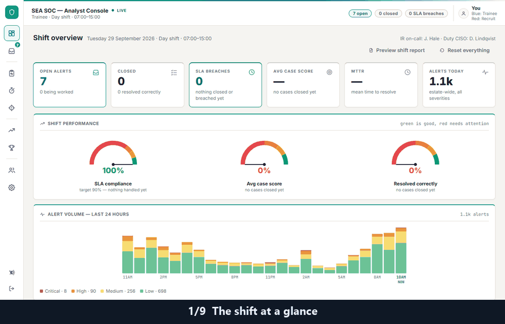
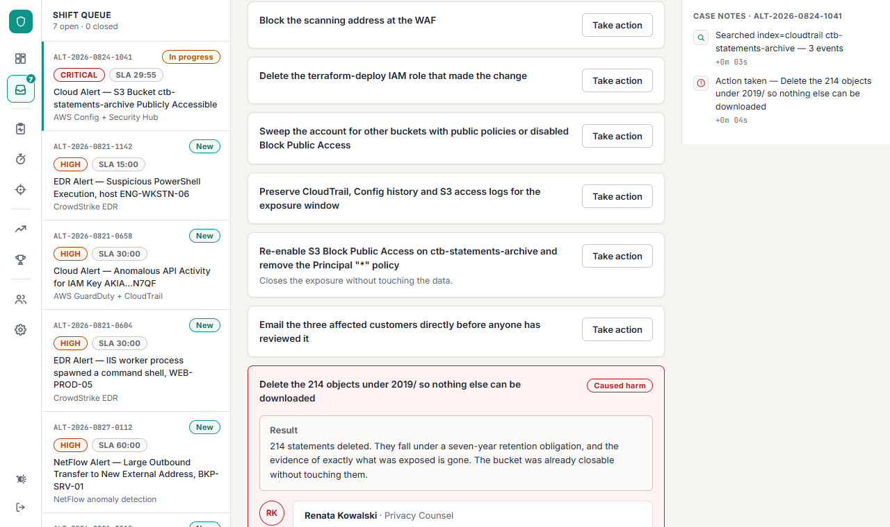
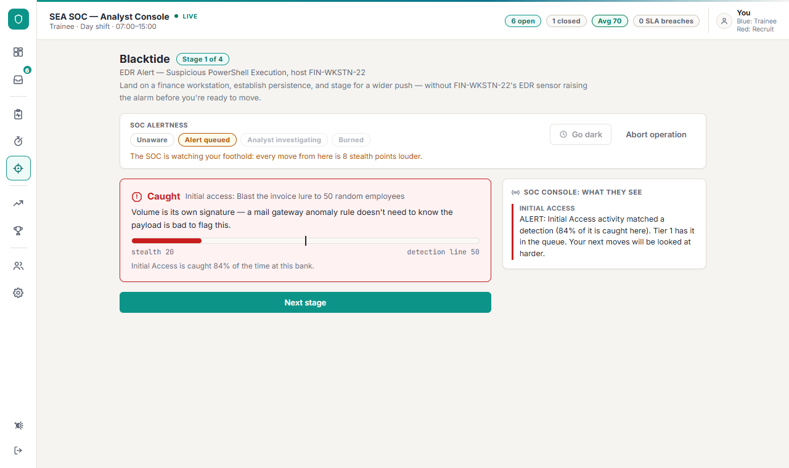
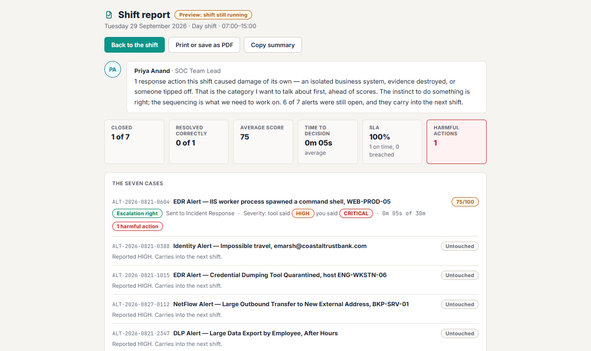
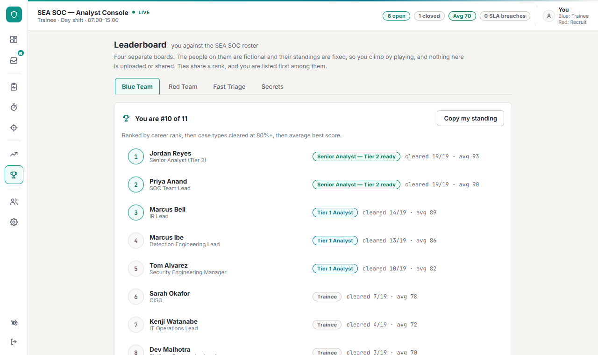
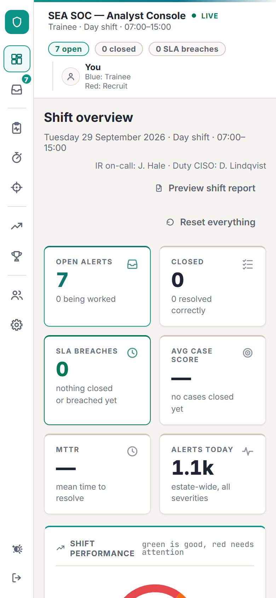

# SOC Analyst Console

**A working replica of a Tier-1 SOC analyst's shift, built to practice the job rather than a quiz about it.** Alerts arrive with SLA clocks running. You type your own searches, enrich indicators you pull out of the evidence, take response actions that can help or make things worse, and write the incident report, at a fictional bank where a CISO, an IR lead and an employment lawyer react to what you actually did.

[](https://github.com/nicky-quist/soc-analyst-simulator/actions/workflows/deploy.yml)
&nbsp; **[Live demo →](https://nicky-quist.github.io/soc-analyst-simulator/)**



## Why it exists

Most SOC practice tools stop at "classify this alert correctly" and hand you the evidence: click the pivot, read the result, pick from the dropdown. Real Tier-1 work has three parts a multiple-choice question can't reach: you have to *find* the evidence, decide *what to do about it*, and live with the consequences of both. The most common way a new analyst fails isn't picking the wrong classification. It's searching the wrong index, leaving the time picker on its default, treating "no records found" as "clean," or reaching for a containment action that breaks something.

So this is built so those things can happen to you.

## Try it in two minutes

1. Open the [live demo](https://nicky-quist.github.io/soc-analyst-simulator/) and go to **Alert queue**. Open the top alert.
2. On **Investigate**, take a value from the alert (a host, an IP) and search it, like `index=edr <host>`. The console defaults to a 15-minute window, on purpose: widen it if you get "0 events".
3. On **Respond**, take an action. Nothing says which are right, and some make it worse. The person it affects answers back.
4. On **Report**, classify it, judge the severity, pick an ATT&CK technique, decide who it goes to, and write it up. Submit to be graded, with the answer explained.
5. Then try **Red Ops** (play the attacker while the SOC reacts to every move), **Fast triage** (twenty alerts against the clock) and the **Leaderboard**.

Short on time? **Skip to debrief** on any case shows a fully graded example.

## What makes it different

- **You find the evidence.** Nothing is clickable. You type the search, choose the index and widen the window. A mistyped octet, the wrong index and the default time range each return "0 events" with a specific, different diagnosis.
- **Response actions can hurt.** There are 125 of them across the library and 51 are mistakes: rebooting a compromised host, isolating your own scanner, deleting the evidence, blackholing your own origin. The people affected reply in character, and a harmful action fails the case whatever the report says.
- **Grading you can audit.** It's rubric-based and deterministic, with no LLM in the loop. A test builds a textbook-perfect report for every scenario and requires exactly 100, which catches any rubric point that has quietly become unreachable.
- **Both sides of the table, and a career.** Seventeen Blue Team scenarios, four Red Ops operations you play from the attacker's chair, a timed volume-triage mode, ranks you earn by breadth and not by volume, and four leaderboards against a fictional SOC roster.

## A look around

| | |
|---|---|
|  |  |
| **Respond.** A destructive action is recorded, and the IR lead says what it cost. | **Red Ops.** Each move is caught or slips past, and the SOC gets louder. |
|  |  |
| **Shift report.** How the shift actually went, printable. | **Leaderboards.** Blue, Red, Fast Triage and secrets. |

It also works on a phone (checked at 375px wide and on a short landscape screen) and from the keyboard (a skip link, arrow-key tabs, and dialogs that hold focus):



## By the numbers

17 scenarios · 31 searchable data sources · 82 searches over 317 events · 125 response actions · 4 Red Ops operations · 36 Fast Triage cards · 20 hidden secrets · 383 automated tests

## Run it

```bash
npm install
npm run dev          # http://localhost:5173
npm run test:all     # 373 engine tests (Node) and 10 UI smoke tests (jsdom)
```

React 19 and Vite, no backend, and no runtime dependencies beyond React. Everything stays in your browser. CI runs lint, both test suites, the build and the deploy on every push.

## Read more

- **[Features](docs/FEATURES.md)**: a tour of every tab and system, from the dashboard to the shift report.
- **[Scenarios](docs/SCENARIOS.md)**: all seventeen alerts, and the table of ways to get each one wrong.
- **[Design](docs/DESIGN.md)**: how grading, progression and the deal work, the decisions behind them, and how it's built and tested.
- **[Lab setup](LAB_SETUP.md)**: the planned live-telemetry mode.
