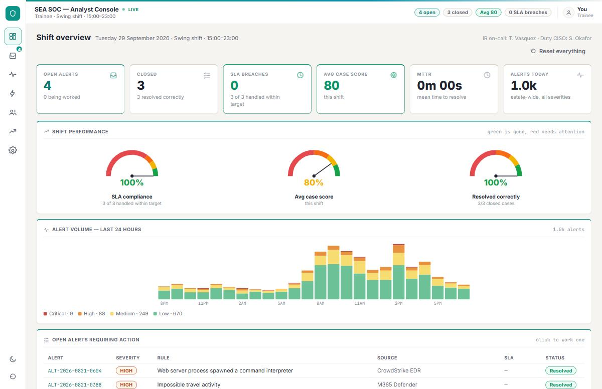

# SOC Analyst Console

A working replica of a Tier-1 analyst console, built to practice the whole shift rather than a quiz about it: a shift dashboard shows you what the estate is doing, alerts arrive in a queue with SLA clocks running, you investigate by typing your own searches against simulated data sources, enrich indicators you pull out of the evidence yourself, take real response actions that can help or make things worse, and write the incident report — at a fictional bank, Coastal Trust Bank, with a CISO, a CEO, an IR lead and an employment lawyer who react to what you actually did.

Seventeen alert scenarios dealt seven to a shift, 31 searchable data sources, 82 searches over 317 events, 125 response actions of which 51 are mistakes.

Nine destinations in the side rail, grouped the way an analyst uses them: the shift itself, practice, where you stand, and reference.

| Tab | What it's for |
|---|---|
| **Dashboard** | The shift at a glance: queue, SLA compliance, alert volume, the automation pipeline, ATT&CK coverage, and a live shift-handoff panel |
| **Alert queue** | Work the shift's seven cases: investigate, enrich, respond, write the report, get graded |
| **Alert triage** | Paste any alert or log line and get a first-pass read: format, severity, ATT&CK, indicators, next step |
| **Fast triage** | Twenty noise-heavy alert cards against a 12-minute clock: close, send to Tier 2, or page IR, with no feedback until the run ends |
| **Red Ops** | Run the attacker side of four scenarios as a live operation while the SOC reacts to each move, then defend the same incident and see who won |
| **Your progress** | Your record across shifts, your career rank, and what the next shift will practice |
| **Leaderboard** | Three separate boards, Blue Team, Red Team and Secrets, ranking you against the fictional SEA SOC roster |
| **Security org** | The org chart as a Teams-style contact grid — who's online, their role, and a live presence status derived from real shift state |
| **Settings** | Configure the AI Coach (local Ollama or your own cloud key) without needing to close a case first |

Each tab has its own URL (`#dashboard`, `#queue`, `#triage`, `#fasttriage`, `#redops`, `#progress`, `#leaderboard`, `#team`, `#settings`), so a link can open straight onto one.

**[Live demo →](https://nicky-quist.github.io/soc-analyst-simulator/)**



## Why this exists

Most SOC practice tools (LetsDefend, TryHackMe SOC rooms, and quick-triage tools like this console's own Triage tab) stop at "classify this alert correctly," and they hand you the evidence: click the pivot, read the result, pick from the dropdown. Real L1 work has three parts that multiple-choice can't reach — you have to *find* the evidence, decide *what to do about it*, and live with the consequences of both. The most common way a new analyst fails isn't picking the wrong classification. It's searching the wrong index, leaving the time picker on its default, treating "no records found" as "clean," or reaching for a containment action that breaks something.

So this sim is built so those things can happen to you.

## The console

**Shift dashboard** — the landing view, because a real console opens on posture rather than on a ticket. Six KPI tiles (open, closed, SLA breaches, average case score, MTTR, alerts today), 24-hour alert volume stacked by severity (AM/PM labeled), your queue's severity mix, an actionable open-alerts table you can click straight into, the day's detection sources with their auto-close rates, an SLA compliance trend, top entities by alert count, ATT&CK detection coverage by tactic, a live shift-handoff panel, and a live tail of estate activity. All of it is inline SVG — no charting dependency, no network calls.

**Your numbers, not the estate's.** SLA compliance is a running trend built purely from cases *you've* actually closed with a response-time target — no fictional calendar, no invented weekday. It starts at 100% because you haven't missed anything yet, moves the first time a real case gives it a data point, and every point after that is a case you closed, in the order you closed them. There is no day of the week attached to any point, so it can never disagree with itself.

The panel that matters most is the **alert pipeline**: 41.2M events → 1,284 alerts → 1,133 closed by automation → 151 routed to analysts → 7 in your queue. That funnel is the part of the job a quiz never shows you, and it is why "just look at every alert" is not a strategy.

**Alert queue** — seven alerts with status (New / In progress / Closed), the tool's reported severity, and a live SLA countdown that goes red when breached. Shift KPIs sit in the header too, so the numbers follow you out of the dashboard.

**A dealt hand, not a fixed list.** The library holds seventeen scenarios and a shift deals seven of them, seeded from when the shift started, so a second sitting is a different queue in a different order. The deal is not a straight random draw: every hand is guaranteed at least one alert that should be closed rather than escalated, at least one that has to reach IR tonight, at least two that belong with Tier 2, and a spread of difficulty — because a queue of seven true positives quietly teaches an analyst to escalate everything. Scenarios you were just dealt are also weighted down (not excluded) the next time around, so back-to-back shifts don't keep landing on the same handful of alerts the way an unweighted shuffle does in a library this size.

**The same case doesn't play the same twice.** Every scenario also re-rolls its cosmetic identifiers each shift — the attacker's IP, the compromised hostname, a service account name, a phishing domain — deterministically, so reloading mid-shift never changes them out from under you, but the ssh-brute-force case you solved last week has a different address and host this time. Only pure labels move; nothing the report rubric or the narrative actually reasons about (byte counts, record counts, a key's age) ever changes. **End shift** (the rail's rotate icon) deals the next hand — if anything is still open or escalated, it stops first for a review of exactly who that goes to (Tier 2, IR, or just the next shift) before dealing.

**Overview** — detection metadata (rule, rule ID, data source, entities) and the triggering event, exactly as much as a SIEM would give you. The reported severity is labeled "what the tool said — yours to confirm or overturn."

**Investigate** — a search bar, not a list of buttons. You type `index=auth 185.220.101.45` and get an event table back. The indicators have to come out of the evidence; the console never offers them. Results print with a note explaining what you're looking at, and the search history reads as an investigation log. There's also a decoder for base64 blobs — which is the only way to get the C2 address out of the PowerShell scenario.

**Intel** — paste an indicator, get a feed record: verdict, confidence, first-seen, sources, tags. Defanged input (`1[.]2[.]3[.]4`) is understood, because that's how indicators arrive in tickets.

**Respond** — the containment actions an L1 can really take, with no hint as to which are correct, ordered by a stable shuffle so the bad ones aren't always at the bottom. Two-click confirm, no undo, and every one is recorded in the case.

**Report** — classification, severity, an ATT&CK technique picked from a catalog of plausible candidates, a written summary and remediation, and the escalation decision.

**Case notes** — a running timeline of every search, lookup, action, and decode with elapsed times. It's the audit trail a Tier-2 handoff would be built from, and reading your own back is usually how you notice you spent eleven minutes searching before you contained anything.

**AI Coach** — an optional second, LLM-generated debrief on a closed case, alongside (never instead of) the deterministic CISO/CEO responses. Off by default. Local-first: it talks to your own Ollama instance so nothing leaves your machine, with a bring-your-own-key cloud fallback for anyone without a GPU to spare. Configure it from **Settings** or from the debrief screen itself.

**Career progression** — the title in the header is earned, not a fixed label. Promotion to Tier 1 Analyst requires ten *distinct* scenario types closed at 80%+ — not raw close-count, so re-closing the same easy case across shifts doesn't count. Senior Analyst requires the full library at 80%+, no current weak skill, no escalation lean, and a clean response-action rate. A rank, once earned, is a permanent checkpoint: clearing your history or resetting everything wipes the stats that drive it but never takes the rank back.

**Fast triage** — the volume half of the job. See [Fast triage](#fast-triage) below.

**Red Ops** — run the attacker side of four scenarios as a live operation (choices at the attack's real decision points, never freeform commands or payloads). The SOC reacts to every move as you make it:

- **Caught or slipped past, revealed immediately.** A move is caught when it is quieter than 60% of that tactic's real detection coverage (the same `TACTIC_COVERAGE` numbers the Dashboard shows). It's a comparison, not a dice roll, and a meter shows your stealth against the detection line.
- **The SOC's alertness compounds.** Each caught move raises it one step (Unaware, Alert queued, Analyst investigating), and every later move is 8 stealth points louder per step. The third catch burns the operation.
- **Go dark, once.** Lie low for a day to make the SOC lose a step, at a flat 5-point cost. It only helps once you've been noticed.
- **Abort and bank it.** Ending early scores what you played, scaled by how far you got, so finishing has to pay more than quitting.
- **A SOC console** beside the stage shows what the defenders would see after each move.

Then defend the same incident from the blue side and see a head-to-head comparison on the debrief screen.

**Red Ops career** — the attacker-side mirror of the analyst career, built on the same three rules. Breadth at a standard: a rank needs different operations cleared, using your best completed run of each, so replaying the easiest one gets you nowhere. Finishing counts: only a run that reaches the objective clears an operation, and a burned or aborted run is recorded but can't promote you. A rank is a checkpoint: **Reset everything** wipes the runs and never takes a rank back.

| Rank | Needs |
|---|---|
| Recruit | where everyone starts |
| Red Team Operator | reach the objective at 50+ on 2 different operations |
| Senior Operator — Team Lead ready | every operation cleared at 50+, at least one **ghost run** (objective reached with no move caught), and no more than 2 burned or aborted in your last 6 runs |

The Red Ops tab shows your rank, what the next promotion needs, your record (runs, completed, ghost, burned, aborted) and your best completed score per operation. The header shows both ranks, and a promotion is announced on the debrief the moment a run earns it.

**War Room** — an extra alert outside the dealt library, never dealt directly. If you close the ransomware-precursor case with a required containment step missing, or with a harmful action taken, the shift escalates mid-flight: a 5-minute CRITICAL alert for mass file encryption on the finance file server is injected into your live queue, correlated back to the case that caused it (same C2 address, same host). Only one War Room can be active per shift, and a War Room alert can't trigger another, so a bad night gets one escalation rather than a chain reaction. The trigger is deterministic — exactly "did the response leave the threat live" — with no dice roll.

**Shift handoff** — a Dashboard panel that's always current, not generated once at shift end: any case that's still open or was escalated shows up with its findings, evidence, and what's still needed. **End shift** turns this into an actual moment instead of a silent reset — if anything needs a handoff, it stops to show exactly who picks it up (Jordan Reyes for Tier 2, Marcus Bell for IR, or the next shift's analyst for anything nobody escalated) before dealing the next hand.

Dark by default, with a light toggle.

## Ways to get it wrong

This is the part the sim is actually about. All of these are live:

| What you do | What happens |
|---|---|
| Mistype an octet in a search | `0 events` — "check the indicator character by character." No "did you mean," because a real console doesn't offer one. |
| Leave the time picker at its 15-minute default | `0 events` on a correct search. The hint tells you the search was right and the window wasn't — after you've had a moment to believe nothing happened. |
| Search the right value in the wrong index | "That value exists in this environment — you are searching the wrong data source." |
| Invent an index that doesn't exist | An error listing the ones that do. |
| Mistype an indicator into threat intel | "No records found" — which looks exactly like a clean verdict, and is flagged as such. |
| Run external threat intel on an internal 10.x address | "Private address space — no external intel." A clean result there means nothing; inventory is the right tool. |
| Reboot a compromised host to "kick them out" | The IR lead explains what was in that memory. |
| Isolate the source of a scan that turned out to be your own vulnerability scanner | Security Engineering's manager, on the compliance scan you just killed. |
| Reply to the fraudulent vendor email to confirm the account | You just emailed the attacker, from inside the mailbox they're sitting in. |
| Reimage a ransomware-precursor host before triage | IR can no longer tell whether credentials were stolen, so the incident is now unscoped. |
| Contact the employee in the insider case, or disable their account on your own authority | Employment counsel, on why that isn't Security's call to make alone. |
| Delete the scheduled task and close the ticket | One artifact gone, C2 still live, and the operator now knows they were seen. |
| Rewrite the git history to remove a leaked cloud key and call it fixed | The key is still valid, still in every clone, still being used. Only deactivating it is containment. |
| Delete the IAM user instead of the key | Production ETL breaks and the audit trail stops resolving, for no extra containment. |
| Restore a quarantined credential dumper because the admin says it is approved | The request they cite is still unapproved — you can see that in the ticket. |
| Close a blocked detection because "the EDR handled it" | The block is not the finding. Two other hosts ran the same tool unblocked. |
| Delete the exposed statements to stop a public bucket being read | Privacy counsel: they are records under a seven-year retention obligation, and the evidence of which three were taken is gone. Turning Block Public Access back on stopped it. |
| Delete the deployment role that made the bad change | Platform Engineering: every pipeline, including the emergency failover, now fails, and the bucket was fixable in one click. |
| Isolate a laptop over a file that never executed | Disruption without benefit, on the one host where nothing happened. |

Harmful actions fail the case outright, whatever the report says. A correct classification followed by a damaging response is not a resolved alert.

## Learn Mode

Every scenario has a **📖 Learn mode** walkthrough of how a senior analyst works that specific alert — which search to run and why, how to read the result, why the response order is isolate → preserve → remediate. Use it either way: study it first, or attempt the alert cold and check your reasoning afterward. Opening it before you submit tags that attempt **Assisted** in the shift record — not a penalty, just an honest label.

## Scenarios (17)

- **SSH brute force that succeeded** — true positive, critical. Tests whether you notice the single `Accepted password` line buried after the failures, widen the time range to find the post-login activity, and connect `/etc/shadow` plus a `tar` of the MySQL directory to credential theft and data staging. The asset record also shows configuration drift: root SSH login enabled on a host that was never meant to accept SSH from the internet.
- **Vulnerability scanner flagged as reconnaissance** — false positive. Tests whether you identify an internal source through asset inventory and the change calendar before acting, and whether you resist quarantining your own department's scanner mid-window.
- **Phishing → token replay → attempted wire fraud** — true positive, critical, 10-minute target. Four separate-looking signals that are one Business Email Compromise. MFA didn't prompt because the phishing page took the session cookie, which is why revoking sessions has to come before resetting the password. There's still time to stop the payment if you find it.
- **Malicious macro → PowerShell downloader → ransomware precursor** — true positive, critical. The C2 address only exists inside a base64 `-EncodedCommand`, so the investigation doesn't proceed until you decode it. Then: persistence, share enumeration, live beaconing, and three other mailboxes that got the same attachment, two still unopened.
- **Ambiguous insider case — large after-hours export by a departing employee** — deliberately not a clean true/false positive. The anomaly is scale, timing, destination, and a missing approval — not access. One of the required searches legitimately returns zero rows, and that emptiness is the finding.
- **Leaked AWS key → S3 enumeration and download** — true positive, critical, and the first one with no host to isolate and no malware to find. A service-account key sat in a public repo for six days; the whole investigation runs through CloudTrail, IAM, and the secret-scanning log. Two traps: rewriting the git history feels like remediation and invalidates nothing, and "the bucket was accessible" is a very different sentence from "12,900 customer records were downloaded."
- **Credential-dumping tool quarantined on an admin's laptop** — the escalation-calibration case: the right answer is **Tier 2**, and both neighbors are wrong. The block worked here, so it is not an IR page; the same hash executed unblocked two days ago on two hosts with a 14-month-old sensor, so it is not a closure either. The tool is dual-use, there is a pending approval request nobody actioned, and the user is a domain admin. One available action is restoring the file because the admin asks you to.
- **MFA push fatigue ending in an approval** — true positive, critical, 20-minute target. The password succeeded every time and only the second factor was challenged, so the credential is already stolen; fourteen denials from one address then a single approval is a user worn down, not a user signing in. The detection rated it MEDIUM, and everything that makes it critical (a newly registered authenticator, a changed recovery address, an inbox rule, Treasury downloads) sits in logs the detection never read.
- **Impossible travel that is really the VPN** — false positive. The "foreign" address is the bank's own EU VPN egress, never added to named locations, and the change calendar shows an emergency failover that morning. The skill is disproving a plausible story quickly and defensibly, and three of the available actions (blocking the egress, disabling the user, revoking sessions for everyone behind that address) would take down working staff.
- **Web shell on an internet-facing IIS server** — true positive, critical, 15-minute target. An IIS worker process spawning `cmd.exe` is enough on its own; the EDR trail shows enumeration, a look at a loan-document share, and a second stage pulled with `certutil`. The trap is cleanup: deleting the shell or rebooting feels like remediation and destroys the evidence while the second stage keeps running.
- **Crypto miner on a CI build agent** — true positive, high, **Tier 2**. The IDS signature reads as a nuisance policy alert, but no human is in the execution chain: an npm postinstall script from a two-day-old package fetched the miner and added a SYSTEM scheduled task on a machine holding a deployment token and a signing key. The miner is the visible part; the supply-chain exposure is the case.
- **OAuth consent phishing** — true positive, high, **Tier 2**. No malware, no failed sign-ins, no impossible travel: the user approved a real Microsoft consent screen for an unverified app, and a second user did the same nine minutes later. The access lives in a grant and a refresh token, so resetting passwords does nothing, and the audit trail (mail access, searches for "wire" and "invoice") is what shows it's real.
- **Possible DNS tunnel from signed marketing software** — the case that should *not* be resolved. Fourteen thousand TXT queries with near-unique 48-character labels to a domain first seen three days ago is data being encoded, but the binary is signed and the domain has no reporting. The right classification is "suspicious, needs more investigation", with a precise statement of what is known and what would settle it; closing it either way is the mistake.
- **Public S3 bucket from a Terraform change** — true positive, high, **Tier 2**, and the mirror image of the leaked-key case. The CSPM says CRITICAL, confidential data, publicly accessible; the access log says one scanner listed the bucket, downloaded three 2019 statements, and was refused on newer years. The bucket policy opens `ListBucket` on everything but `GetObject` only on one prefix, so the exposure is real and narrow. The cause was a reviewed plan nobody read and a policy check set to warn instead of block. The traps are overreactions: deleting the exposed statements breaks a retention obligation, deleting the deploy role stops every deployment, and emailing customers first commits the bank before Privacy has chosen a position.
- **HTTP flood where the mitigation misses one hostname** — true positive, high, **IR**, the first availability case. The tool says MEDIUM and MITIGATED, and mitigated events are graded down automatically. The CDN is blocking over 99% on `www` and `login`; a five-year-old DNS record lets the same flood hit an origin directly, and members on the older mobile app are already failing. The tool's "mitigated" describes the hostnames it covers, not the estate. The traps are reflexes: blocking a botnet's top hundred addresses does nothing, a geo-block cuts off customers abroad, and null-routing your own origin completes the outage.
- **Compromised vendor remote session** — true positive, high, **Tier 2**, and the first trusted-relationship case. The bank's managed IT provider has standing remote-management access to about 300 hosts, and the tool grades an off-hours session LOW because the vendor and the software are both on the allow-list. Every field it checked is green and every field it didn't is wrong: an address the vendor has never used, 02:10, reconnaissance and a scheduled task named like the vendor's own monitoring, and no ticket. The vendor's own breach advisory sat unread in a shared mailbox for two days. Nothing has been copied yet, so the honest call is a foothold for Tier 2 to hunt, not a confirmed loss. The traps are over-broad containment: uninstalling the agents from all 300 hosts wipes the evidence, and blocking the vendor's whole range takes down the card-file transfer while the attacker was never in it.
- **Nightly backup to a migrated vendor address** — benign, expected activity, close with no escalation. NetFlow flags 412 GB leaving the backup server for an address it has never used and rates it HIGH, because the detection has no idea what the host is. It is the same nightly job, same size and same 01:00 start it has run for 30 nights; the backup vendor migrated its range, announced it, and had it approved under a change ticket, and the detection allow-list was never updated. The lesson is the cheap check (baseline, change record, who owns the destination) and being able to prove a boring answer. It exists to balance a library where most alerts are real. The traps are the two things a nervous analyst does: blocking the destination or isolating the server both cost the bank its offsite copy, and paging IR is scored as over-escalating.

## Grading

A case is scored on four things, because a shift is judged on four things:

| Component | Weight |
|---|---|
| Classification | 20 |
| Escalation decision | 20 |
| Severity (half credit one step off) | 10 |
| MITRE ATT&CK technique (parent technique counts) | 10 |
| Written report rubric | 25 |
| Response actions taken | 15 |

**"✓ Resolved correctly"** requires the right classification and escalation — and the correct escalation is not always upward: across the seventeen scenarios the right answer is IR eight times, Tier 2 six times, and close-without-escalating three times, so over-escalating is a scored error too. It also requires a severity that isn't wildly off, a report complete enough to hand over, and no harmful action. **Investigation coverage**, **time to decision**, and **search efficiency** are reported next to the score but deliberately excluded from it — the score grades the case, and folding process into it hides which one you actually got wrong. The CISO covers the process instead: getting the right answer without running the checks earns "right answer, wrong process."

## Progress across shifts

A shift grades seven cases and then forgets them, which can't answer what a trainee actually wants to know: what do I keep getting wrong? **Your progress** (the trend icon in the rail) keeps a record of every case you close across shifts, splits each into the individual calls the grader already scores (classification, escalation, severity, ATT&CK mapping, investigation coverage, response, report, and response time), and shows your rate and recent trend for each. It also tracks which way your escalation mistakes lean, since under- and over-escalating are different habits with different costs.

The record is kept honest on purpose:

- **First attempts only.** A retry comes after the debrief has shown you the answer, so counting it would measure recall of the debrief.
- **Learn mode excludes a case.** Opening the walkthrough means the evidence was pointed out, not found.
- **One bad case is not a weakness.** Rates are smoothed, and a skill needs four scored cases before it can be named.

**The adaptive deal.** Once a skill is consistently weak, the next shift is weighted toward scenarios that exercise it, and the dashboard says so. Each rule targets what trips that skill rather than anything related to it. Most of the library needs escalating, so an under-escalator is dealt the cases whose alert *undersells* them (reported MEDIUM, really CRITICAL), not simply cases that need escalating. For severity, it's the alerts reported two or more steps off. Where the library doesn't vary on anything that predicts a skill (thirteen of seventeen scenarios need exactly four checks, for example), the only signal used is which scenarios you slipped on before. It's a weighting, not a filter, so the mix quotas still hold on every focused shift, and the tests check that each rule moves its main target's chance of being dealt by at least 0.10.

The focus is decided when a shift is dealt and stored with it. The queue is re-derived from the shift on every load, so reading live history instead would re-deal a different hand the moment you closed a case, and drop your open ones. A golden file of 900 hands pins the unfocused deal so it can't drift unnoticed. It is regenerated, deliberately, whenever the library grows, which re-deals any shift saved before that change.

## Fast triage

The seven-case shift trains depth: find the evidence, contain, write it up. **Fast triage** trains the volume side, where most alerts a human sees get about ninety seconds and the skill is reading the two lines that decide it.

A run deals 20 alert cards from a pool of 36 and gives you 12 minutes. Each card shows only what a SIEM row would (source, rule, reported severity, four fields) and nothing to search. You answer **Close**, **Tier 2**, or **Page IR** (keys `1`, `2`, `3`), and you get no feedback until the run ends. Then a review lists every alert, mistakes first, with the one detail that decided it.

- **Guaranteed mix.** Every run has 9 closes, 7 Tier 2 and 4 IR, so it can't turn into a queue of true positives. It also always includes at least two alerts that *read scary but are benign* (an authorized scanner, a VPN egress, a live red-team engagement) and two that *read routine but are real* (a hidden inbox rule, a web shell rated MEDIUM). Those are the two ways triage goes wrong.
- **Cost-weighted score, not a percent.** The costs aren't symmetric: closing an IR-worthy alert costs 3, sending a benign one to Tier 2 costs 0.5. The score is 100 minus the share of the worst possible cost. Alerts you never reached count as a backlog, not as correct.
- **Closing a live threat caps the grade at C**, whatever the rest of the run looked like, the same rule the main sim applies to a damaging response after a correct report.
- **Kept honest.** Runs are seeded, so the deal is reproducible from its seed and varies across seeds; only finished runs are saved (last 20, in local storage); refreshing mid-run abandons it; **Reset everything** on the Dashboard clears them along with the rest.

## Leaderboard

Three separate boards, each ranking you against the fictional SEA SOC roster (the people the console already puts in front of you, like the Team Lead, the IR Lead and the CISO). Their standings are fixed, so a board looks the same every time and you climb it by playing. It is you against the sim's own people: nothing is uploaded or shared.

| Board | Ranked by |
|---|---|
| **Blue Team** | career rank, then case types cleared at 80%+, then average best score |
| **Red Team** | Red Ops rank, then operations cleared, then ghost runs, then best completed score |
| **Secrets** | how many hidden secrets you have found |

Ties share a rank (1, 2, 2, 4) and you are listed first among them. **Copy my standing** puts a short summary of all three ranks on the clipboard. Reset everything keeps ranks and found secrets and clears the record behind them, so the boards show the same rank with the progress bars back at zero. Every roster standing is beatable: a test builds a perfect player and checks they take first place on all three boards, and that a new player leads none of them. Roster standings also stay true as the library grows (a senior analyst has cleared every case type by definition).

## Secrets

There are twenty things hidden in the console. It never says how to find them; Settings lists the ones you have found and shows "???" for the rest, and one of them is a credits card. They are small in-voice rewards for doing what a curious person might try, spread across the investigation tools, the report, Fast triage, Red Ops, the theme toggle and the keyboard.

- **Never part of the game.** A secret is announced and nothing more. None reads into a grade, a rank, your history or the "assisted" flag, and none can be tripped by working a real case: a test runs every scenario's own searches and lookups through the matchers to prove it.
- **Reset everything leaves them alone**, like a rank. The only way to forget them is the button in Settings.
- **Matchers are pure** (`engine/easterEggs.js`), so each trigger is unit-tested, along with the Konami tracker, the burst counter that catches rapid clicking, and the storage.

## Alert triage

The **Triage** tab is a first-pass reader for an alert that isn't in the shift queue. Paste a raw log line or alert, and it identifies the format, scores severity with a confidence percentage, maps the activity to ATT&CK, extracts indicators, estimates how likely it is to be a false positive, and recommends a next step. The result can be exported as a `.txt` report, and the tab keeps a history of the session's analyses.

It started as a separate project, `soc-triage-tool`, and was merged in with its commit history. It runs a deterministic rule engine in the browser ([`src/engine/triage`](src/engine/triage)). Nothing you paste leaves the tab, there's no API key, and every verdict traces back to a specific pattern match rather than a model's judgment.

| Format | What the rules look for |
|---|---|
| Syslog | SSH brute force (failure count, root/admin targeting, non-existent users), sudo/su elevation |
| Windows Event Log | Malicious PowerShell (download cradles, `-EncodedCommand`), failed logons (4625), lateral movement over admin shares, persistence via Run keys and scheduled tasks |
| Suricata JSON | Cobalt Strike and other C2/malware signatures, exploit attempts, scans, and the alert's own severity |
| Zeek `conn.log` | Long, high-volume flows (beaconing), connections to common C2 ports, large uploads (exfiltration) |
| CEF | Credential-dumping tools, exploit activity, and whether the device blocked it |
| DNS logs | Base64-looking subdomain labels, a high-entropy flag when the log includes one, high outbound byte counts |
| Free text | Lateral movement, malware delivery URLs, reconnaissance commands, file names and hashes |

Input that's too thin to triage (a bare URL, a lone base64 blob, a fragment with no technical detail) is rejected with an explanation rather than guessed at.

**A bug its tests found.** The first Zeek rule scraped the raw text instead of reading columns, so the Unix timestamp became the flow's duration and byte count. On the tool's own sample, a one-hour, 2.3 MB flow was reported as 473,688 hours and 1,626 MB. On other inputs it gave wrong verdicts: ordinary TLS traffic was called a C2 beacon, and a real connection to port 31337 was never flagged. The fix reads the `#fields` header, or the standard conn.log order when there isn't one. Six regression tests cover it, and all six fail against the original code.

## Design notes

- **Deterministic and offline**, in both the grader and the Triage engine: no API key, no third-party calls. Scoring is rubric-based, not an LLM call, so it's auditable and reproducible.
- **Rubric keywords live with the scenario they grade**, so rewording a report point can't silently drop it from the grade. Matching is word-boundary based rather than substring — "HR" has to be the word *HR*, not the "hr" inside "through" — and a trailing `*` marks a stem (`isolat*` credits isolate/isolated/isolation).
- **Some report points are graded on what you didn't write.** The false-positive scenario checks you never recommended blocking your own scanner; the insider scenario checks you didn't state theft as established fact. Negation and hedging pass — "do not block this host" and "potential data theft pending review" are correct analyst writing; "the employee stole records" is the thing being caught.
- **Personas are rule-based**, driven by harm caused, escalation direction, investigation coverage and severity distance rather than per-scenario scripts, so they generalize when scenarios are added. Stakeholder reactions to harmful actions live with the action itself, which is what lets a damaging click answer back immediately instead of at grading time.
- **ATT&CK is kept because analysts really use it** — SIEM detections ship with technique IDs and case tools ask for one on every incident. It's a picker over plausible candidates rather than free text, since choosing between neighboring techniques is the actual difficulty.
- **Roadmap**: a per-shift report card alongside the cross-shift progress view; extending cosmetic-identifier randomization's `variables` pattern to a couple of remaining edge cases (the C2 address baked into `malicious-powershell-precursor`'s base64 blob, a linked derived string in `mfa-push-fatigue`); an async, share-code two-player mode for Red Ops; more scenario categories (the library now covers endpoint, identity, cloud, insider and availability; next would be OT/ICS); and a live-telemetry mode fed by an isolated VM lab (see `LAB_SETUP.md`) instead of static data.

## Tech

React + Vite, no backend.

```bash
npm install
npm run dev
```

```
src/
  data/
    scenarios/  one file per alert — datasets, searches, intel, actions, ground truth
    techniques  51-technique ATT&CK catalog for the picker
    estate      shift-wide dashboard data — seeded per shift: volume, funnel, sources, coverage, feed
    triage-samples  sample alerts and the format guide for the Triage tab
    fasttriage  the 36-card Fast triage pool, with ground truth and the deciding detail for each
  engine/       query parser + executor, intel lookup, base64 decoder, scoring, personas, case state,
                the shift deal, the Fast triage deal and scorer, cross-shift progress and the adaptive focus, and the seeded PRNG
                everything shift-specific is drawn from
    triage/     the Triage tab's rule engine: format detection, analysis, input validation
  components/   dashboard, triage view, progress view, one module per case tab, queue, case timeline
  ui/           primitives, SVG charts, theme tokens
tests/          330 tests across 20 files (triage/ holds the Triage engine's)
```

The engines are unit-tested with Node's built-in test runner — no test framework dependency:

```bash
npm test
```

The tests that matter most: a textbook-perfect case scores exactly 100 on every scenario (which catches a rubric point that has quietly stopped being reachable), every required search is reachable and every required intel lookup resolves (which catches a scenario whose investigation path has been broken by an edit), every scenario offers at least one way to make things worse, and each search failure mode returns its own distinguishable diagnostic. The deal has its own suite: every hand over hundreds of seeds holds its mix quotas, hands differ from each other but never mid-shift, and every scenario in the library gets dealt eventually. The progress suite checks that the record only counts first, unassisted attempts, that no weakness is named from too few cases, that a focused shift still keeps every quota, that each focus rule lifts its target's chance of being dealt by at least 0.10, and that the unfocused deal still matches its golden file of 900 hands.

Fast triage has 18 tests: the pool is well-formed, every one of 300 seeded runs keeps its mix and both trap types, every alert is eventually dealt, a perfect run scores 100, closing everything scores worse than escalating everything, one missed IR page caps an otherwise clean run at C, and saved runs round-trip and are cleared by Reset everything.

The Triage engine has 126 tests of its own. They check each format's verdicts and the relative ordering of severities, the input-rejection rules, and a contract that must hold for every input: every field present, values in range, the same verdict every time, no crash on hostile input, and no network call.
